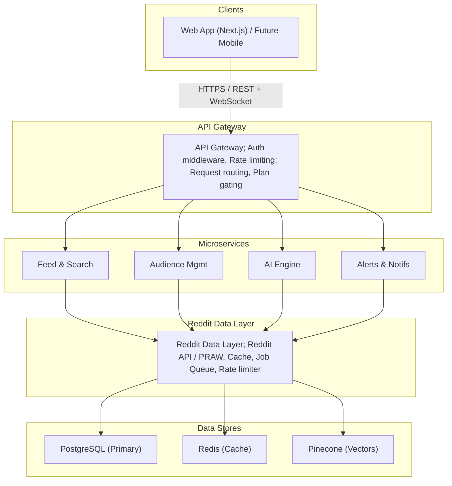

# GummySearch

## Description

GummySearch is a specialized tool which can be used for Reddit Intelligence and Social Listening. GummySearch aggregates specific communities and applies advanced filters to look for leads, pain points or content ideas.

## Features

### Basic Features

1. **Subreddit Discovery**
A search bar to look for subreddits and view/obtain basic stats.
2. **Audience Creation**
Ability to group multiple subreddits into single saved category.
(Eg: "Designers" = r/UI_Design + r/Figma + r/UXDesign)
3. **Aggregated Feed**
A unified timeline and interface for displaying all posts within a selected audience.
4. **Basic Sorting**
Sorting feed by Reddit's native parameters (New, Top Today, Top This Week)
5. **Post Preview**
Click a post to read title and body text natively (without leaving the app and redirecting to Reddit).

### Moderate to Advanced Features

#### Audience Discovery and Management

1. **Saved Audiences**
These audiences (group of subreddits) have been created/selected by the user to follow.
The user can:
    1. rename them
    2. add subreddits to the audience
    3. remove subreddits from the audience
2. **Curated Audiences**
These audiences are lists of subreddits already created by other users/ the web app team. Users can browse, select and save these audiences as per requirement. This helps users discover communities worth tracking without digging through Reddit manually.
3. **Trending Subreddits**
Allows users to discover subreddits that are currently *trending* based on different criterion.
    1. **Largest**
    Looks for the largest subreddits based on: members / number of posts.
    Size can be filtered too.
    (Eg: 1M+ members, 100k-1M members, 10k-100k members, 1k-10k members, etc.)
    2. **Active**
    Looks for the most active communities.
    Can be sorted by: number of posts, traffic to the subeddit, etc.
    Timeline can be: monthly, weekly, daily, etc.
    3. **Growing**
    Filters subreddits based on highest growth in terms of number of members.
    Can be further filtered based on timeline (yearly, monthly, weekly growth) and size (1M+ members, 100k-1M members, 10k-100k members, 1k-10k members, etc.).

#### Subreddits UI on Trending

1. **Tags**
Each subreddit can be tagged based on the following:
    1. Size
    Massive, Large, Moderate, Small
    2. New / Not new
    3. Activity
    Super Active, Highly Active, Barely Active
2. **Line graph**
Plotting number of members/posts over time.
3. **Search**
Search according to name, description, topic
4. **Add to Audience**
Lets users add a subreddit to an existing audience or create a new one.
(Upon creating new audience, suggests similar subreddits for the audience)

#### Audience Analysis

1. **Subreddits**
Display all subreddits present within the audience.
2. **Topics**
Display all topics covered by all the subreddits within the audience.
(Eg: The audience 'Side Hustles' may have the following topics:
Hiring, Money, Remote Work, Referral, etc.)
3. **Themes**
Contains:
    1. **Scoring themes**
    Hot Discussion (Popular discussions that week), Top Content (Best performing content past month), etc.
    2. **AI-tagged themes**
    (Eg: The audience 'Side Hustle' may have Self Promotion, Oppurtunities, Money Talk, Pain & Anger, etc. as AI-tagged themes)
4. **Ask**
Allows users to ask questions relevant to the audience, for which AI will return posts related to the query.

##### Exploring a theme during audience analysis

Selecting any particular theme (scoring/ai-tagged) will display the subcategories (eg: Advice, Questions, Recommendations for the theme 'Advice Request' of audience 'Side Hustle'), topics and subreddits covered by the theme.
It will also display a brief description of that theme.
There should also be an option to display patterns found within the posts related to the theme.

### Advanced Search

This is used for searching for key words within specific audience(s).

#### Options

1. **Audience to search**
Pre-formed audience or 'Anyone'
2. **Keywords to look for**
Define context for search
3. **New/Top/Hot**
4. **Limit**
Number of results
5. **Timeline**
6. **Include/Excluse Users**
7. **Individual Subreddits**
8. **Enable/Disable Subreddits**
9. **Disable Keywords**

#### Results

Displays posts, patterns and sentiments.

### Content performance insights

### Slack/Discord integration

### Product reviews

### Shareable AI reports

## Architecture

### Modular Architecture

The project can be broken down into 6 distinct modules:

1. **Reddit Data Layer**
This module is responsible for all communication with the Reddit API (PRAW / Reddit API). The rest of the modules do not speak to Reddit directly. They communicate with Reddit through this module.
This would include:
    - fetching subreddit metadata, posts, comments and author data
    - handles caching
    - handle rate limiting
    - schedule data refreshes
2. **Audience Management**
Audiences are lists of subreddits grouped together based on different criterion. This module is responsible for handling the creation, storage and retrieval of user-defined audiences. It also manages curated audiences (defined by the team or by other users) and the logic for suggesting related subreddits when a new audience is created.
3. **Feed & Search Engine**
Consumes data from the Reddit Data Layer and serves it to the frontend in a unified, filterable format. Handles aggregated feed construction across multiple subreddits, advanced keyword search with Boolean support, filtering by timeline, post type, subreddit inclusion/exclusion, and user inclusion/exclusion. Also responsible for deduplication and cross-post detection.
4. **AI & Analysis Engine**
The intelligence layer. Responsible for theme tagging, topic extraction, sentiment analysis, pattern detection, comment-level analysis, and the "Ask" feature (RAG-based Q&A over audience posts). Calls out to an LLM (OpenAI / Anthropic) and manages prompt construction, response parsing, and result caching to avoid redundant inference costs.
5. **Alerts, Notifications & Integrations**
Handles all outbound communication — email digests, in-app notifications, Slack and Discord webhooks. Also manages keyword alert rules, brand mention tracking, and scheduling logic (cron jobs for digests and alert checks).
6. **User & Workspace Management**
Handles authentication, user profiles, subscription/billing tiers, team workspaces, bookmarks, internal notes, and shareable report generation. The gating layer — it decides what features each user has access to based on their plan.

### Overall Architecture



### Backend Architecture

#### Backend Stack

- FastAPI as the web framework — async, fast, excellent automatic API docs, very clean to work with
- PRAW for Reddit API
- Celery + Redis for the job queue
- SQLAlchemy + Alembic for ORM and migrations
- LangChain or LlamaIndex for the RAG/Ask pipeline
- OpenAI SDK for embeddings and completions
- Pydantic for data validation (already built into FastAPI)

#### Folder Structure

```markdown
backend/
├── alembic/                        # DB migrations
│   └── versions/
│
├── app/
│   ├── main.py                     # FastAPI app init, router registration
│   ├── config.py                   # Settings via pydantic-settings (.env)
│   ├── dependencies.py             # Shared FastAPI dependencies (db, auth)
│   │
│   ├── reddit/                     # Module 1 — Reddit Data Layer
│   │   ├── client.py               # PRAW client setup + wrapper methods
│   │   ├── cache.py                # Redis caching logic for raw Reddit data
│   │   ├── schemas.py              # Pydantic models for Reddit data
│   │   └── utils.py                # Rate limit handling, retry logic
│   │
│   ├── audiences/                  # Module 2 — Audience Management
│   │   ├── router.py               # FastAPI routes
│   │   ├── service.py              # Business logic
│   │   ├── repository.py           # DB queries (SQLAlchemy)
│   │   ├── models.py               # SQLAlchemy ORM models
│   │   └── schemas.py              # Pydantic request/response models
│   │
│   ├── feed/                       # Module 3 — Feed & Search Engine
│   │   ├── router.py
│   │   ├── feed_service.py         # Aggregation, dedup, pagination
│   │   ├── search_service.py       # Keyword + Boolean search logic
│   │   ├── models.py               # Post ORM model (cached Reddit data)
│   │   └── schemas.py
│   │
│   ├── ai/                         # Module 4 — AI & Analysis Engine
│   │   ├── router.py
│   │   ├── theme_service.py        # Theme tagging + topic extraction
│   │   ├── sentiment_service.py    # Sentiment analysis per post/comment
│   │   ├── ask_service.py          # RAG pipeline ("Ask" feature)
│   │   ├── embedding_service.py    # Chunking + embedding posts → Pinecone
│   │   ├── pattern_service.py      # Pattern detection across posts
│   │   └── prompts/                # Prompt templates (LangChain)
│   │       ├── theme_tagging.py
│   │       ├── ask.py
│   │       └── sentiment.py
│   │
│   ├── alerts/                     # Module 5 — Alerts & Integrations
│   │   ├── router.py
│   │   ├── alert_service.py        # Keyword alert rule evaluation
│   │   ├── digest_service.py       # Email digest construction
│   │   ├── slack_service.py        # Slack webhook integration
│   │   ├── discord_service.py      # Discord webhook integration
│   │   ├── models.py
│   │   └── schemas.py
│   │
│   ├── users/                      # Module 6 — Users & Workspaces
│   │   ├── router.py
│   │   ├── auth_service.py         # JWT, OAuth2, token refresh
│   │   ├── user_service.py
│   │   ├── workspace_service.py
│   │   ├── bookmark_service.py
│   │   ├── report_service.py       # Shareable AI report generation + S3
│   │   ├── models.py
│   │   └── schemas.py
│   │
│   └── common/                     # Shared utilities
│       ├── database.py             # Async SQLAlchemy engine + session
│       ├── redis.py                # Redis connection pool
│       ├── exceptions.py           # Custom exception classes
│       ├── middleware.py           # Logging, CORS, error handling
│       └── pagination.py           # Shared pagination helpers
│
├── workers/                        # Celery workers (separate process)
│   ├── celery_app.py               # Celery init + config
│   ├── tasks/
│   │   ├── ingest.py               # Fetch + cache Reddit posts per audience
│   │   ├── embed.py                # Chunk + embed new posts into Pinecone
│   │   ├── analyze.py              # Run AI analysis on new posts
│   │   ├── alerts.py               # Evaluate alert rules against new posts
│   │   └── digest.py               # Build + send scheduled email digests
│   └── schedules.py                # Celery Beat periodic task definitions
│
├── tests/
│   ├── unit/
│   └── integration/
│
├── .env
├── requirements.txt
├── Dockerfile
└── docker-compose.yml
```

#### Data Flow: Post Ingestion Pipeline

```markdown
Celery Beat (scheduled)
        │
        ▼
Task: ingest.py — fetch_audience_posts(audience_id)
        │
        ├── PRAW → fetch posts for each subreddit in audience
        │
        ├── Deduplicate against existing PostgreSQL records
        │
        ├── Write new posts → PostgreSQL (async SQLAlchemy)
        │
        ├── Update Redis feed cache
        │
        ├── Chain → Task: embed.py — embed_new_posts(post_ids[])
        │             │
        │             └── embedding_service → chunk + embed → Pinecone
        │
        ├── Chain → Task: analyze.py — analyze_new_posts(post_ids[])
        │             │
        │             └── theme_service + sentiment_service → tag + score
        │
        └── Chain → Task: alerts.py — evaluate_alerts(audience_id)
                      │
                      └── alert_service → match keywords → push notification
                                │
                                └── WebSocket push to active clients
```

#### AI Pipeline: For Ask Feature

```markdown
User query (natural language)
        │
        ▼
ask_service.py
        │
        ├── embedding_service → embed query → query vector
        │
        ├── Pinecone → similarity search → top-K relevant post chunks
        │
        ├── Fetch full post context from PostgreSQL
        │
        ├── LangChain → construct prompt with retrieved context
        │
        ├── OpenAI API → LLM completion
        │
        └── Return structured response (answer + source posts)
```

#### API Structure

```markdown
/auth
  POST   /auth/register
  POST   /auth/login
  POST   /auth/refresh

/audiences
  GET    /audiences                         # List user's audiences
  POST   /audiences                         # Create audience
  GET    /audiences/{id}                    # Audience detail
  PATCH  /audiences/{id}                    # Rename / update
  DELETE /audiences/{id}
  POST   /audiences/{id}/subreddits         # Add subreddit
  DELETE /audiences/{id}/subreddits/{name}  # Remove subreddit
  GET    /audiences/curated                 # Browse curated audiences

/feed
  GET    /feed/{audience_id}                # Paginated aggregated feed
  WS     /feed/{audience_id}/live           # WebSocket live updates

/search
  POST   /search                            # Advanced search with filters

/analysis
  GET    /analysis/{audience_id}/topics
  GET    /analysis/{audience_id}/themes
  GET    /analysis/{audience_id}/themes/{theme_id}
  POST   /analysis/{audience_id}/ask        # RAG "Ask" query

/subreddits
  GET    /subreddits/search                 # Subreddit discovery
  GET    /subreddits/trending               # Trending with filters

/alerts
  GET    /alerts
  POST   /alerts
  PATCH  /alerts/{id}
  DELETE /alerts/{id}

/users
  GET    /users/me
  PATCH  /users/me
  GET    /users/workspace
  POST   /users/bookmarks
  GET    /users/bookmarks
  POST   /users/reports/{audience_id}       # Generate shareable report
```

#### Infrastructure at a Glance

```markdown
┌─────────────────────────────────────────────────┐
│              FastAPI Application                │
│         (Uvicorn + Gunicorn workers)            │
└────────────────────┬────────────────────────────┘
                     │
        ┌────────────┼────────────┐
        │            │            │
   PostgreSQL      Redis       Pinecone
   (Primary DB)  (Cache +    (Vector store)
                  Queue broker)
        │            │
        └────────────┘
                │
        Celery Workers
        (separate containers)
                │
        Celery Beat
        (scheduler container)
```
