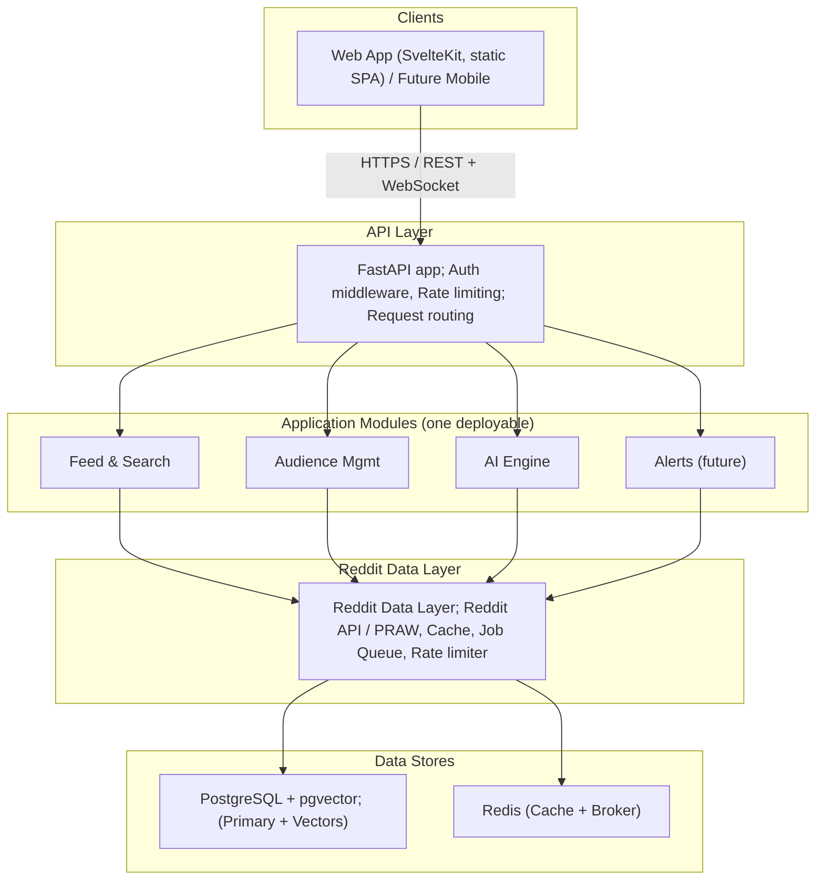

# JammySearch

## Description

JammySearch is a specialized tool for Reddit Intelligence and Social Listening. It aggregates specific communities and applies advanced filters to surface the leads, pain points and content ideas buried beneath the raw posts.

Engineering standards for this project are defined in `.specify/memory/constitution.md`, which takes precedence over this document where the two disagree.

## Features

### Basic Features

1. **Subreddit Discovery**
A search bar to look for subreddits and view/obtain basic stats.
2. **Audience Creation**
Ability to group multiple subreddits into single saved category.
(Eg: "Designers" = r/UI_Design + r/Figma + r/UXDesign)
3. **Aggregated Feed**
A unified timeline and interface for displaying all posts within a selected audience.
4. **Basic Sorting**
Sorting feed by Reddit's native parameters (New, Top Today, Top This Week)
5. **Post Preview**
Click a post to read title and body text natively (without leaving the app and redirecting to Reddit).

### Moderate to Advanced Features

#### Audience Discovery and Management

1. **Saved Audiences**
These audiences (group of subreddits) have been created/selected by the user to follow.
The user can:
    1. rename them
    2. add subreddits to the audience
    3. remove subreddits from the audience
2. **Curated Audiences**
These audiences are lists of subreddits already created by other users/ the web app team. Users can browse, select and save these audiences as per requirement. This helps users discover communities worth tracking without digging through Reddit manually.
3. **Trending Subreddits**
Allows users to discover subreddits that are currently *trending* based on different criterion.
    1. **Largest**
    Looks for the largest subreddits based on: members / number of posts.
    Size can be filtered too.
    (Eg: 1M+ members, 100k-1M members, 10k-100k members, 1k-10k members, etc.)
    2. **Active**
    Looks for the most active communities.
    Can be sorted by: number of posts, traffic to the subeddit, etc.
    Timeline can be: monthly, weekly, daily, etc.
    3. **Growing**
    Filters subreddits based on highest growth in terms of number of members.
    Can be further filtered based on timeline (yearly, monthly, weekly growth) and size (1M+ members, 100k-1M members, 10k-100k members, 1k-10k members, etc.).

> **Data cold start.** The Reddit API exposes a subreddit's *current* member count only — there is no
> history endpoint. Growth trends and member/post line graphs therefore require JammySearch to snapshot
> subreddit stats itself on a daily schedule and accumulate its own history. The snapshot task should
> be built and left running early, well before the UI that consumes it, because the feature displays
> nothing meaningful until weeks of data exist.

#### Subreddits UI on Trending

1. **Tags**
Each subreddit can be tagged based on the following:
    1. Size
    Massive, Large, Moderate, Small
    2. New / Not new
    3. Activity
    Super Active, Highly Active, Barely Active
2. **Line graph**
Plotting number of members/posts over time.
3. **Search**
Search according to name, description, topic
4. **Add to Audience**
Lets users add a subreddit to an existing audience or create a new one.
(Upon creating new audience, suggests similar subreddits for the audience)

#### Audience Analysis

1. **Subreddits**
Display all subreddits present within the audience.
2. **Topics**
Display all topics covered by all the subreddits within the audience.
(Eg: The audience 'Side Hustles' may have the following topics:
Hiring, Money, Remote Work, Referral, etc.)
3. **Themes**
Contains:
    1. **Scoring themes**
    Hot Discussion (Popular discussions that week), Top Content (Best performing content past month), etc.
    2. **AI-tagged themes**
    (Eg: The audience 'Side Hustle' may have Self Promotion, Oppurtunities, Money Talk, Pain & Anger, etc. as AI-tagged themes)
4. **Ask**
Allows users to ask questions relevant to the audience, for which AI will return posts related to the query.

##### Exploring a theme during audience analysis

Selecting any particular theme (scoring/ai-tagged) will display the subcategories (eg: Advice, Questions, Recommendations for the theme 'Advice Request' of audience 'Side Hustle'), topics and subreddits covered by the theme.
It will also display a brief description of that theme.
There should also be an option to display patterns found within the posts related to the theme.

### Advanced Search

This is used for searching for key words within specific audience(s).

#### Options

1. **Audience to search**
Pre-formed audience or 'Anyone'
2. **Keywords to look for**
Define context for search
3. **New/Top/Hot**
4. **Limit**
Number of results
5. **Timeline**
6. **Include/Excluse Users**
7. **Individual Subreddits**
8. **Enable/Disable Subreddits**
9. **Disable Keywords**

#### Results

Displays posts, patterns and sentiments.

### Keyword Alerts

Standing rules that watch for specific language so a researcher does not have to re-run the same
search every day. This is what makes lead-finding practical — someone publicly asking for what you
sell is worth reaching within hours.

1. **Rules**
Keyword rules scoped to an audience, which can be paused, edited, and deleted. Evaluated against
newly collected material rather than run on demand.
2. **In-app matches**
Matches are surfaced inside the application, identifying which rule matched and why. Outbound
delivery — email, Slack, Discord — is deferred (see **Future Scope**).
3. **Act in place**
A matched post can be read in full, saved, and given a status without leaving the alert view.

### Saved posts and lead tracking

Any post can be bookmarked with a private note and a status (new, contacted, dismissed), so what has
already been acted on stays separable from what has not. This is personal workflow state, not a CRM —
outreach itself happens elsewhere.

### AI quality and cost transparency

JammySearch treats its AI layer as measured engineering rather than as a black box. See constitution
principles VII–IX for the binding rules; the user-visible parts are:

1. **Cited answers**
Every "Ask" response cites the specific posts it drew from, and explicitly declines to answer when
retrieval turns up nothing relevant, rather than falling back on the model's general knowledge.
2. **Cost and cache dashboard**
Surfaces AI spend, token usage, latency, cache hit rate, and the number of Reddit API calls avoided
by caching — per audience and in aggregate.
3. **Published evaluation results**
Theme tagging, sentiment scoring, and retrieval are scored against a labeled evaluation set committed
to the repository, with a non-LLM baseline reported alongside the model for comparison.

## Future Scope

Deliberately **not** part of the current build. JammySearch is being built first as a portfolio project
and as a personal market-research tool for a single user, so the following are deferred until there
is a reason to add them:

- **Billing and monetization** — Stripe integration, subscription tiers, plan gating, webhook
  reconciliation, proration handling.
- **Team workspaces** — multi-tenancy, shared audiences, role-based permissions. Until then JammySearch
  is single-user, which keeps every query free of tenant scoping.
- **Outbound integrations** — Slack and Discord webhooks, scheduled email digests.
- **Shareable AI reports** — public report generation and hosting.
- **Content performance insights** and **product reviews** — currently undefined; these need a
  specification before they can be scoped.
- **WebSocket live feed** — polling is sufficient at Reddit's posting rate; live push adds
  infrastructure for negligible user benefit.

## Architecture

### Modular Architecture

The project can be broken down into 6 distinct modules. Modules 1–4 are the active build; modules 5
and 6 are largely deferred (see **Future Scope**) beyond the minimum auth needed to sign in.

JammySearch is deployed as a **modular monolith**, not as microservices. The module boundaries below are
enforced in code — no module may query another's tables, and only module 1 may call Reddit — so
individual modules can be extracted into services later if load ever justifies it. Until then, a
single deployable is the correct choice for a project of this size, and the boundaries cost nothing
to maintain.

1. **Reddit Data Layer**
This module is responsible for all communication with the Reddit API (PRAW / Reddit API). The rest of the modules do not speak to Reddit directly. They communicate with Reddit through this module.
This would include:
    - fetching subreddit metadata, posts, comments and author data
    - handles caching
    - handle rate limiting
    - schedule data refreshes
2. **Audience Management**
Audiences are lists of subreddits grouped together based on different criterion. This module is responsible for handling the creation, storage and retrieval of user-defined audiences. It also manages curated audiences (defined by the team or by other users) and the logic for suggesting related subreddits when a new audience is created.
3. **Feed & Search Engine**
Consumes data from the Reddit Data Layer and serves it to the frontend in a unified, filterable format. Handles aggregated feed construction across multiple subreddits, advanced keyword search with Boolean support, filtering by timeline, post type, subreddit inclusion/exclusion, and user inclusion/exclusion. Also responsible for deduplication and cross-post detection.
4. **AI & Analysis Engine**
The intelligence layer. Responsible for theme tagging, topic extraction, sentiment analysis, pattern detection, comment-level analysis, and the "Ask" feature (RAG-based Q&A over audience posts). Calls out to Groq for chat completions (open-weight models, via LangChain) and embeds locally with a HuggingFace sentence-transformers model, and manages prompt construction, response parsing, and result caching to avoid redundant inference costs.
5. **Alerts, Notifications & Integrations** *(mostly deferred)*
Manages keyword alert rules, brand mention tracking, and scheduling logic. In-app alerts are in
scope; outbound channels — email digests, Slack and Discord webhooks — are deferred.
6. **User & Workspace Management** *(minimal)*
Handles authentication, user profiles, bookmarks and internal notes. Subscription tiers, plan gating,
team workspaces, and shareable report generation are deferred; JammySearch is single-user for now.

### Overall Architecture


```mermaid
graph TD
    subgraph Clients ["Clients"]
        WebApp["Web App (SvelteKit, static SPA) / Future Mobile"]
    end

    WebApp -- "HTTPS / REST + WebSocket" --> APIGateway

    subgraph API_Gateway ["API Layer"]
        APIGateway["FastAPI app; Auth middleware, Rate limiting; Request routing"]
    end

    APIGateway --> Feed
    APIGateway --> Audience
    APIGateway --> AI
    APIGateway --> Alerts

    subgraph Modules ["Application Modules (one deployable)"]
        Feed["Feed & Search"]
        Audience["Audience Mgmt"]
        AI["AI Engine"]
        Alerts["Alerts (future)"]
    end

    Feed --> RedditData
    Audience --> RedditData
    AI --> RedditData
    Alerts --> RedditData

    subgraph Data_Layer ["Reddit Data Layer"]
        RedditData["Reddit Data Layer; Reddit API / PRAW, Cache, Job Queue, Rate limiter"]
    end

    RedditData --> PostgreSQL
    RedditData --> Redis

    subgraph Storage ["Data Stores"]
        PostgreSQL["PostgreSQL + pgvector; (Primary + Vectors)"]
        Redis["Redis (Cache + Broker)"]
    end
```

### Backend Architecture

#### Backend Stack

- FastAPI as the web framework — async, fast, excellent automatic API docs, very clean to work with
- PRAW for Reddit API
- Celery + Redis for the job queue
- SQLAlchemy + Alembic for ORM and migrations
- PostgreSQL with the `pgvector` extension as the vector store — no separate vector database, one
  fewer service to run and one fewer index to keep in sync with the source of record
- LangChain for the RAG/Ask pipeline and as the single orchestration layer over model calls
- Groq (`langchain-groq`) for chat completions against open-weight models — no per-token cost at this
  scale
- Local HuggingFace `sentence-transformers` embeddings (`langchain-huggingface`) — runs in-process, no
  API key, no network call, no cost
- Pydantic for data validation (already built into FastAPI)
- pytest + pytest-asyncio for tests, ruff for lint and formatting

#### Folder Structure

```markdown
backend/
├── alembic/                        # DB migrations
│   └── versions/
│
├── app/
│   ├── main.py                     # FastAPI app init, router registration
│   ├── config.py                   # Settings via pydantic-settings (.env)
│   ├── dependencies.py             # Shared FastAPI dependencies (db, auth)
│   │
│   ├── reddit/                     # Module 1 — Reddit Data Layer
│   │   ├── client.py               # PRAW client setup + wrapper methods
│   │   ├── cache.py                # Redis caching logic for raw Reddit data
│   │   ├── schemas.py              # Pydantic models for Reddit data
│   │   └── utils.py                # Rate limit handling, retry logic
│   │
│   ├── audiences/                  # Module 2 — Audience Management
│   │   ├── router.py               # FastAPI routes
│   │   ├── service.py              # Business logic
│   │   ├── repository.py           # DB queries (SQLAlchemy)
│   │   ├── models.py               # SQLAlchemy ORM models
│   │   └── schemas.py              # Pydantic request/response models
│   │
│   ├── feed/                       # Module 3 — Feed & Search Engine
│   │   ├── router.py
│   │   ├── feed_service.py         # Aggregation, dedup, pagination
│   │   ├── search_service.py       # Keyword + Boolean search logic
│   │   ├── models.py               # Post ORM model (cached Reddit data)
│   │   └── schemas.py
│   │
│   ├── ai/                         # Module 4 — AI & Analysis Engine
│   │   ├── router.py
│   │   ├── theme_service.py        # Theme tagging + topic extraction
│   │   ├── sentiment_service.py    # Sentiment analysis per post/comment
│   │   ├── ask_service.py          # RAG pipeline ("Ask" feature)
│   │   ├── embedding_service.py    # Chunking + embedding posts → pgvector
│   │   ├── pattern_service.py      # Pattern detection across posts
│   │   ├── baseline.py             # Non-LLM extraction baseline for comparison
│   │   ├── telemetry.py            # Per-call cost / latency / cache-hit records
│   │   └── prompts/                # Versioned prompt templates (never inline)
│   │       ├── theme_tagging.py
│   │       ├── ask.py
│   │       └── sentiment.py
│   │
│   ├── alerts/                     # Module 5 — Alerts & Integrations
│   │   ├── router.py
│   │   ├── alert_service.py        # Keyword alert rule evaluation
│   │   ├── digest_service.py       # Email digest construction
│   │   ├── slack_service.py        # Slack webhook integration
│   │   ├── discord_service.py      # Discord webhook integration
│   │   ├── models.py
│   │   └── schemas.py
│   │
│   ├── users/                      # Module 6 — Users & Workspaces
│   │   ├── router.py
│   │   ├── auth_service.py         # JWT, OAuth2, token refresh
│   │   ├── user_service.py
│   │   ├── workspace_service.py
│   │   ├── bookmark_service.py
│   │   ├── report_service.py       # Shareable AI report generation + S3
│   │   ├── models.py
│   │   └── schemas.py
│   │
│   └── common/                     # Shared utilities
│       ├── database.py             # Async SQLAlchemy engine + session
│       ├── redis.py                # Redis connection pool
│       ├── exceptions.py           # Custom exception classes
│       ├── middleware.py           # Logging, CORS, error handling
│       └── pagination.py           # Shared pagination helpers
│
├── workers/                        # Celery workers (separate process)
│   ├── celery_app.py               # Celery init + config
│   ├── tasks/
│   │   ├── ingest.py               # Fetch + cache Reddit posts per audience
│   │   ├── embed.py                # Chunk + embed new posts into pgvector
│   │   ├── analyze.py              # Run AI analysis on new posts
│   │   ├── alerts.py               # Evaluate alert rules against new posts
│   │   └── digest.py               # Build + send scheduled email digests
│   └── schedules.py                # Celery Beat periodic task definitions
│
├── tests/
│   ├── unit/
│   └── integration/
│
├── evals/                          # AI quality measurement (constitution IX)
│   ├── datasets/                   # Labeled posts: themes, sentiment, Ask relevance
│   ├── run_eval.py                 # Scores current prompts/models against datasets
│   └── results/                    # Recorded scores per prompt + model version
│
├── .env
├── requirements.txt
├── Dockerfile
└── docker-compose.yml
```

#### Data Flow: Post Ingestion Pipeline

```markdown
Celery Beat (scheduled)
        │
        ▼
Task: ingest.py — fetch_audience_posts(audience_id)
        │
        ├── PRAW → fetch posts for each subreddit in audience
        │
        ├── Deduplicate against existing PostgreSQL records
        │
        ├── Write new posts → PostgreSQL (async SQLAlchemy)
        │
        ├── Update Redis feed cache
        │
        ├── Chain → Task: embed.py — embed_new_posts(post_ids[])
        │             │
        │             └── embedding_service → chunk + embed → pgvector
        │
        ├── Chain → Task: analyze.py — analyze_new_posts(post_ids[])
        │             │
        │             └── theme_service + sentiment_service → tag + score
        │
        └── Chain → Task: alerts.py — evaluate_alerts(audience_id)
                      │
                      └── alert_service → match keywords → push notification
                                │
                                └── WebSocket push to active clients
```

#### AI Pipeline: For Ask Feature

```markdown
User query (natural language)
        │
        ▼
ask_service.py
        │
        ├── embedding_service → embed query → query vector
        │
        ├── pgvector → similarity search → top-K relevant post chunks
        │
        ├── Relevance gate → if below threshold, return "not enough material"
        │
        ├── Fetch full post context from PostgreSQL
        │
        ├── LangChain → construct prompt (retrieved posts delimited as untrusted data)
        │
        ├── LLM completion → temperature 0, pinned model, versioned prompt
        │
        ├── Validate against Pydantic response schema
        │
        ├── Emit telemetry (tokens, cost, latency, cache hit, prompt version)
        │
        └── Return structured response (answer + cited source posts)
```

#### API Structure

The HTTP surface is defined in
[`specs/001-reddit-audience-intelligence/contracts/rest-api.md`](specs/001-reddit-audience-intelligence/contracts/rest-api.md),
which is the single source of truth for routes, request and response shapes, the shared pagination
and error envelopes, and which requirement each endpoint satisfies.

It is deliberately **not** restated here. Maintaining the same API surface in two documents
guarantees they drift, and a drifted API document is worse than no API document — see Principle III
of the constitution.

Broadly, the surface covers: `/audiences` and `/audiences/starter`, `/audiences/{id}/feed`,
`/search`, `/audiences/{id}/analysis/*` and `/ask`, `/alerts/rules` and `/alerts/matches`,
`/communities/*`, `/bookmarks`, and `/ops/*` for cost, quota, and evaluation transparency.

#### Infrastructure at a Glance

```markdown
┌─────────────────────────────────────────────────┐
│              FastAPI Application                │
│         (Uvicorn + Gunicorn workers)            │
└────────────────────┬────────────────────────────┘
                     │
        ┌────────────┴────────────┐
        │                         │
   PostgreSQL                   Redis
   (Primary DB +              (Cache +
    pgvector store)            Queue broker)
        │                         │
        └────────────┬────────────┘
                │
        Celery Workers
        (separate containers)
                │
        Celery Beat
        (scheduler container)
```
